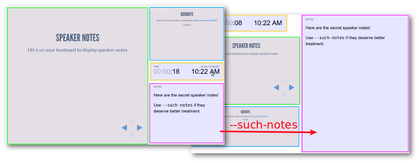
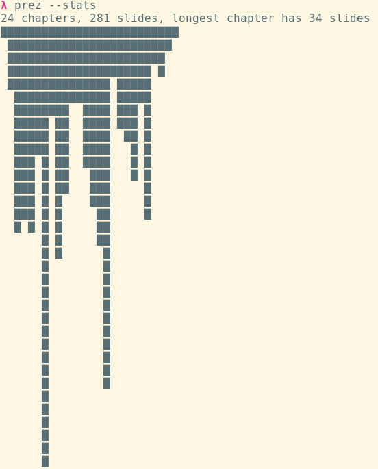

[](http://badge.fury.io/js/prez)
[](https://david-dm.org/byteclubfr/prez)

## prez

Opiniated [Reveal slideshow](http://lab.hakim.se/reveal-js) generator with nice PDF output and ability to treat [notes](https://github.com/hakimel/reveal.js#speaker-notes) as first-class content.

### Install

```sh
npm install -g prez
```

### Feel the magic

In your terminal, go to an empty directory and run:

```sh
prez --init
```

A sample workspace has been generated for you. Then run:

```sh
prez --serve --print --watch
```

* edit your slides from `slides` folder (html or [markdown](https://www.npmjs.com/package/marked))
* if you need some assets, you can work in `images`, `css`, `js`, `media` folders and use `includes.txt`
* your slideshow is automatically built into `build` folder
* your slideshow is hosted and your browser is opened to localhost:9000
* any change you make will rebuild and refresh your browser
* oh, and a printer-friendly `slides.pdf` is automatically generated on any change too

### Slides structure and format

* Slides and chapters (vertical stacks) are sorted by name.
* If a slide or a chapter name starts with a dot `.` (hidden), it will be skipped. (or use `--keep-hidden`)
* You can number your slides to ensure order by adding a "*number*-" prefix, it will be automagically stripped out.
* Each slide will have an id generated from filename (removing accents and spaces).
* If you use `--sub-covers` the title is the stripped name, accents and case remain untouched.

#### Sample structure

```
images/
js/
css/
slides/
  01-intro.md
  02-Chapter 1/
    01-hello-world.md
    02-bonjour-monde.md
  03-conclusion.md
```

#### Sample slide

```md
# Slide's title

Content of your slide

note:

Your notes go here.

Complex (multiline, code samples, etc.) notes are really supported only with --such-notes.
```

#### Customize slide attributes

You can set per-slide properties like general style, [background](https://github.com/hakimel/reveal.js/#slide-backgrounds) or [transition](https://github.com/hakimel/reveal.js/#slide-transitions) by adding special lines at **the head of your slides**:

* `$class:some class$` add class
* `$id:id$` replace automatic id, if you set it to "none", it will remove any id on the slide
* Any other property will be added as a data-attribute, here are some examples supported by Reveal:
  * `$background:/path/to/image.jpg$`
  * `$background-video:/path/to/video.webm$`
  * `$background-iframe:http://mysite.com$`
  * `$transition:zoom$`
  * `$transition-speed:fast$`

### Step by step

#### Initialize sample workspace

```sh
mkdir sandbox
cd sandbox

prez --init
```

This will create a full workspace with `js`, `images`, etc… where you'll put your custom content. In reality the only required folder is `slides`.

#### Build

```sh
prez
```

This will create a `build` folder with your slideshow.

#### Show

```sh
prez --serve
```

This will run a server on port 9000 and open your local browser to your slideshow.

#### Print

```sh
prez --print --print-theme=simple
```

This will generate "slides.pdf" from your slideshow.

### Such notes!

Option `--such-notes` modifies the print layout and the notes popup so that notes have more space.



### Usage

`prez [<source> [<destination>]] [options]`

* `source` is the slideshow workspace (where you'll have your slides and assets), default = `./`
* `destination` is the target directory, default = `./build/`

#### Available options:

* `-v`, `--version`: show version and exit
* `-s <dir>`, `--slides-dir=<dir>`: customize name of the folder containing slides (default = `slides`)

Assets & slides

* `--init`: populate your new presentation with dummy initial data (see the content of `data/init`)
* `--skip-reveal`: do not copy reveal.js slides into target directory (useful if you want faster build over existing build)
* `--skip-index`: do not generate `index.html` in target (will remain untouched if already existing)
* `--skip-user`: do not include user assets
* `--keep-hidden`: render slides or chapters starting with a dot `.`
* `--sub-covers`: auto generate cover slides with the dir name as a h1 for each chapter (vertical stack of slides)

Custom parser

* `--parser`: parser used to convert slides from Markdown to HTML, available values are:
  * *marked* (default, depending on [`marked`](https://www.npmjs.com/package/marked) and `highlight.js`, automatically embedded)
  * *marky-markdown* (requires installation of [`marky-markdown`](https://github.com/npm/marky-markdown) and note that [`highlight`](https://www.npmjs.com/package/highlights)'s themes are not embedded so you'll have to include the CSS file yourself yet)
  * *markdown-it* (requires installation of [`markdown-it`](https://github.com/markdown-it/markdown-it))
  * *remarkable* (requires installation of [`remarkable`](https://github.com/jonschlinkert/remarkable))
  * Path to custom module, relative to current working directory. This module's default export must be a function taking a string (original content) and return a string (converted content). You can use a custom module when you need to call an external command, or our defaults do not match your preferences. You can browser `lib/parsers` to look for our implementations.

Meta

* `--title=<title>`: specify the title of your presentation (default = `package.json name` if found or `Prez`)
* `--author=<author>`: specify the author of your presentation (default = `package.json author` if found)
* `--description=<description>`: specify the description of your presentation (default = `package.json description` if found)

Theme

* `--theme=<theme>`: choose [reveal theme](https://github.com/hakimel/reveal.js/tree/master/css/theme) (default = `solarized`)
* `--highlight-theme=<theme>`: choose [highlight.js theme](https://github.com/isagalaev/highlight.js/tree/master/src/styles) (default = `zenburn`)
* `--no-dynamic-theme`: disable ability to change theme from query string
* `--print-notes`: enable special print layout with first-class notes
* `--such-notes`: focus on notes, which will enable a special print layout with notes as first-class content, and more space for them in the notes popup

Live server

* `-w`, `--watch`: automatically rebuild (lazy) on changes
* `--serve[=<port>]`: serve slideshow (you can specify port here or use `--port`)
* `-p <port>`, `--port=<port>`: modify http server port (default 9000), you can use value `auto` to use a random available port
* `--no-live-reload`: disable live-reload when serving slideshow
* `--no-open-browser`: do not open local browser automatically when serving slideshow

Print

* `--print[=<file>]`: print slideshow as pdf (requires `--serve` and phantomjs must be installed)
* `--print-theme=<theme>`: theme to be used for pdf output (default = no override)
* `--phantomjs=<path to phantomjs>`: path to phantomjs (default = `phantomjs`)

Misc

* `--no-update-notifier`: disable version checking
* `--stats`: display visual stats about your slides and chapters



#### Configuration file

You can store your default preferences in a configuration file. Take a look at [CONFIG.md](CONFIG.md) for details.

### TODO

* Lazier reprint in watch mode
* FIX issue with notes too tall in printed pdf
